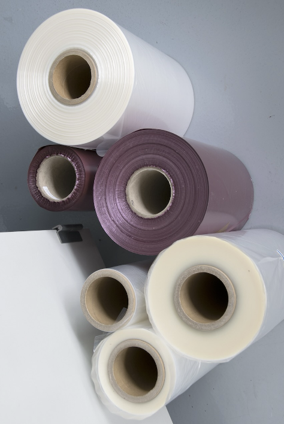
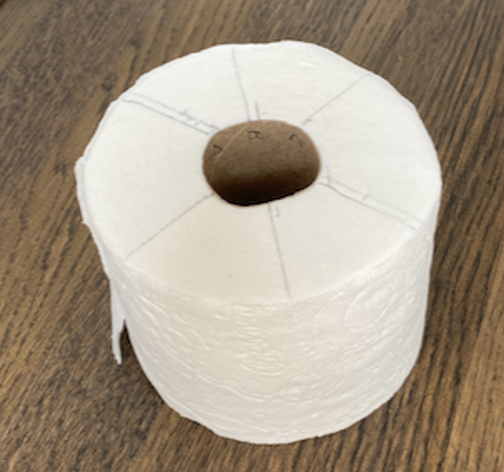
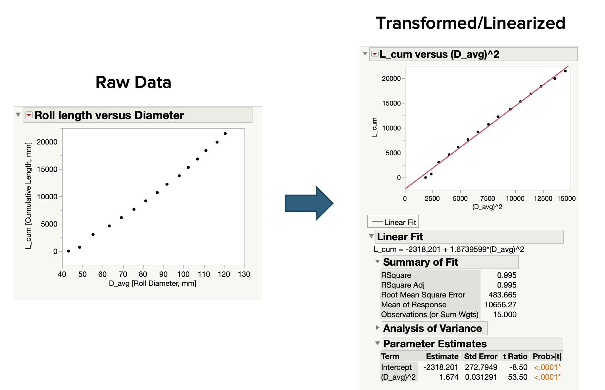
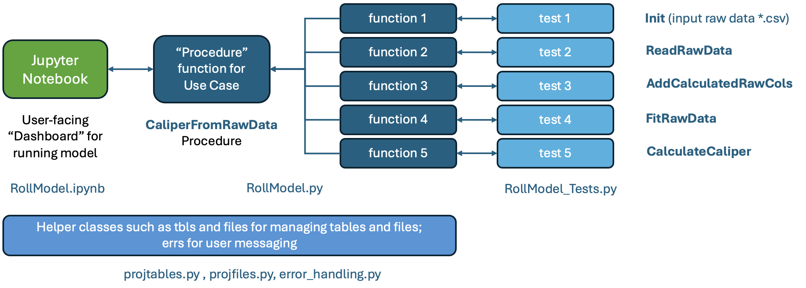
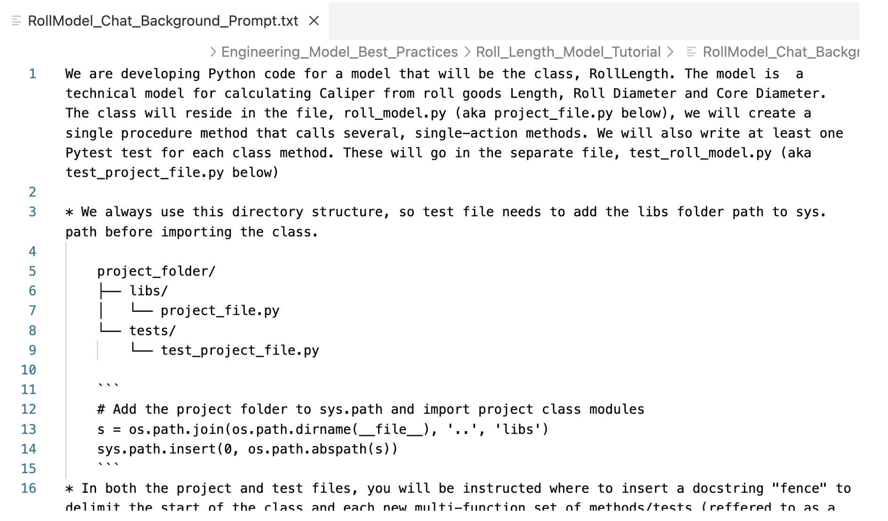

### Tutorial for Using LLM Model Chat to Code An Engineering Model
J.D. Landgrebe, Data Delve LLC</br>
February, 2025

This tutorial walks through creating Python code and validation for a useful industrial model. We demonstrate using an LLM AI tool, Github Copilot Chat to code the model and Pytest tests in a separate file to validate the model’s calculations. We teach use of a code architecture that does a good job “curating” the model –making it transparent to work with and expand later. We also view it as critical to have rerunnable model validation in the form of coded tests. The Chat tool makes this efficient --doing the bulk of the coding work and requiring just minor, human cleanup of its output.

#### Contents
- [Modeling Case Study Description](#modeling-case-study-description)
- [Overview of Coding the Model](#overview-of-coding-the-model)
- [Getting Needed Software](#getting-needed-software)
- [Architecting the Code](#architecting-the-code)
- [Using LLM Chat To Generate the Python Code](#using-llm-chat-to-generate-the-python-code)
- [Style Suggestions to Curate the Model](#style-suggestions-to-curate-the-model)

#### Modeling Case Study Description
As a case study to work with, we will code a model that can calculate the caliper or z-direction thickness of a substrate wound on a roll. Some example substrates are nonwoven fabrics and film raw materials such as packaging film. Toilet paper and paper towels are consumer product examples.  We will use test our model on data measured for toilet paper purchased from a grocery store.

<p align="center">
    
    
</p>
When working with such substrates, it is often beneficial to have a model for the length, L, of material on the roll versus the diameter, D<sub>roll</sub>. The model can calculate such things as how long a raw material roll will run on a line at a given speed or how much the roll weighs given its basis weight (weight per unit area). For consumer products, the model can estimate how long a roll of given diameter will last at average length used per day. The material’s caliper, is a key property. In our model, it will be an effective caliper based on how winding compresses the substrate.</br></br>

The equation below comes from integrating an ordinary differential equation for how differential length changes with differential diameter as substrate of caliper, C is wrapped onto the core having outer diamer, D<sub>core</sub>. 

The second form of the equation shows a useful rearrangement. Practically, for most substrates, C is approximately constant. This then predicts that L versus D<sub>roll</sub><sup>2</sup> will be a straight line with slope $\pi/4C$. &pi;/4C<br>

  
  


#### Getting Needed Software
To do this type of modeling, you need to know some Python. Current AI tools are a great time-saver and also often come up with creative solutions, but they also often need specific coding guidance from your prompts. They also sometimes make mistakes. Our goal is to use the LLM Chat to get the code 85 to 90% right and complete. This is then followed by doing minimal cleanup. 

If you don’t have Python on your computer, the [Anaconda Distribution]( https://www.anaconda.com) is a good way to get it. Install it, and you can create and run *.py files per our tutorial. If you need help with the details of how to do that, ask ChatGPT.  We will also use Python’s Pytest open-source library to validate our model. Pytest gets installed as part of the Anaconda distribution.

There are other choices, but we use Microsoft’s [Visual Studio Code]( https://code.visualstudio.com) to edit *.py files containing code and *.txt files containing AI tool prompts. By itself, it is free, but its Copilot Chat paid extension is recommended because Chat is aware of your code and terminal outputs. Our tutorial was tested with that. VS Code allows splitting the screen into three, side-by-side parts –code file, test file and Chat pane containing your dialog with it.

#### Overview of Coding the Model
Our tutorial is based on using an object-oriented (OO) Python approach where the “model” is a class that may contain multiple “procedures” to perform various use cases. Given the above model equation, we will need to initialize a Python class called something like **RollModel** and create a  **CaliperFromRawData** class method aka "procedure function" that can be called after instancing the class with a raw data filename as input (more on the definition of "procedure" in a minute). The procedure function can call sub-functions to import length and diameter data, transform the diameter to D<sub>roll</sub><sup>2</sup>, fit a line through L versus that and then back-calculate Caliper from the slope. 

Model and test coding will consist of feeding a background prompt into Chat to explain what we want and then asking Chat to write the class methods and to write Pytest tests. The tutorial explains how to run the tests

#### Architecting the Code
The architecture diagrammed below is great for a model like this. Relative to the diagram, as outlineed above, our “use case” is to calculate Caliper from Length versus Diameter data e.g. **CaliperFromRawData**. The architecture calls for this to be split up into elemental sub-functions that are modular and single-action. The latter is consistent with software engineering wisdom and is advantageous for both curation and for instructing Chat in a systematic way. It is a choice compared to just writing the procedure as meandering code lines --making it easy to zero in on a function that needs troubleshooting or to expand the model by inserting additional functions in the chain.  Practically, it works well to write the modular functions first and then write the procedure at the end once everything is working.



For our use case/procedure, a good recipe of functions is:
* Read Raw Data (length in meters; roll diameter in mm)
* Add Calculated Columns (to get diameter converted to meters and add diam^2)
* Fit Line To Data (L versus diam^2)
* Calculate Caliper from Slope 

We will also need to create the class’ \_\_init\_\_ function to initialize class attributes. In fact, we like the curation practice of initializing all attributes in \_\_init\_\_--whether they are being set there or later in one of the other functions.


#### Using LLM Chat To Generate the Python Code 
Our approach with Chat is to first point it to an extensive background prompt. Ours is **RollModel_Chat_Background_Prompt.txt**. It gives Chat our general expectations for both the project code functions and corresponding tests. To get things started, do the following:
1.	Make a new folder for your project and open that folder in VSCode (File menu / Open Folder)
2.	A good practice is to use **libs** and **tests** subfolders to store code within the project. In this case, our project will consist of a single *.py file in **libs** and a *.py file in **tests** along with a validation data *.csv. The folders help keep things organized in higher complexity projects that entail multiple files in each subfolder.
3.	In VS Code, create new, blank files for the project and tests. Save one  as **roll_model.py** in **libs** and save **test_roll_model.py** to **tests** folder
4.	Copy **RollModel_Chat_Background_Prompt.txt** from the tutorial files to your **libs** folder. 
5. You can use **RollModel_Chat_Background_Prompt.txt** as a starting point for any project if you customize the file names and the Pytest fixtures specific for the model. The file is designed to have all project-specific info in its top sections. (If you are not familiar with Pytest and "fixtures" specifically, ask ChatGPT to give you a quick tutorial on them.)

    

6.	Give Chat your first prompt: 
    
    <code>
    Do you understand the background in Roll_Model_Chat_Prompt.txt?
    </code> 
    Hopefully, it responds with “yes” 
7.	We need to do some “top of file” setup for the tests file. It will need to import pandas, numpy, pytest, os and sys from the standard, available libraries. We also need to import the RollModel class from roll_model.py, but, to do so, we need to get the libs folder added to sys.path so that it can find our project *.py file. Here is a prompt to create that code for pasting into the tests file:</br>
    ```
    write the import statements for the test file. including setting a path to the project's libs folder to import the RollLength class. Include the requested fixtures
    ```

8.	One other detail to get started is to give the rl fixture some test data for validation. There are a couple of considerations for this:

    - When using the model, we probably want to input length versus diameter data as a *.csv file whose path + filename string is an argument when initializing the class. This means that the **rl** test fixture should be modified to create a *.csv file with known, validation data points
    - Since we will be fitting a line to length versus diameter, using just two rows of data makes it easy to hand calculate the slope and intercept of the line passing through the points.

    Based on this, the following prompt should get us an updated rl fixture with validation data creation where length is in meters and diameter in mm.</br>
    <code>
    write an updated version of rl test fixture that uses the pfTestData fixture and which creates the *.csv file saved as pfTestData. It has two columns: length and diameter with two rows: length: [0, 20] and diameter: [40, 120]
    </code>

    For upcoming checks, you can do your own hand calculations from the starting point that after converting to meters, diam_m: [0.040, 0.120] and diam_m^2: [0.0016, 0.0144]. You can hand calculate slope and intercept values for these L versus diam_m^2 points.

9.	Ask Chat to initialize a class called RollModel. A good approach is to ask for it to have optional arguments for the raw data file path and all model variables: **filepath_length_diam_csv**, **length**, **diam**, **diam_core** and **caliper**. Our current use case just needs **filepath_length_diam_csv**, but including other inputs makes the class flexible for other use cases such as asking it to calculate a roll’s length from a given diameter and known caliper.
10.	Ask Chat to write a test for the rl fixture that verifies that the *.csv exists and contains the two columns and two rows in your prompt. To run all tests (e.g. functions that begin with “test_” in the tests file), do the following:
    - Open a command line window and cd to the tests folder
    - Run: $ pytest test_roll_model.py -v -s
11.	Once you have the fixture passing its test, ask Chat to write the individual functions and tests. From the list above under Architecting The Code, you can ask for the following functions as class methods and ask for the associated test functions to validate:
    - ReadRawData
    - AddCalculatedRawCols
    - FitRawData
    - CalculateCaliper
12.	You will probably need some iterations with the above steps to get this working efficiently. For learning purposes, it is not a good idea to just copy/paste these, but our list of prompts is in Code_Writing_Prompts.xlsx spreadsheet. These successfully create a working model with only minimal cleanup required.

#### Style Suggestions to Curate the Model
As discussed above, you should clean up its code before calling it good. This is good for curation as well as for leaving a project you can be proud of. Chat has a tendency to parrot back your instructions as comments.</br></br>
We do not need a model with sections of code lines like this: 

```
#Set x to 4
x=4
```

Here are additional style suggestions to curate your code. Our tutorial is based on these which are a part of making the code self explanatory to humans and AI.
* Names matter for making the code readable to humans, and it appears to provide context to LLMs also. We use descriptive camel case function and class names like ReadRawData and CalculateRollWeight. For variable names, use underscore separators, and make them descriptive and  consistent. An example is that our project needs to check results against hand or test-calculated **expected_slope** and **expected_intcpt**. Those names are far superior to **param1** and **param2**.
* Keep project functions single action which means 20 lines long or so. It is ok for tests to be a bit longer as long as they are well curated with descriptive comments
* The class' \_\_init\_\_ function should initialize all attributes including setting internally generated ones to None, [] empty list and pd.DataFrame() empty dataframe. The \_\_init\_\_ should include comments documenting what they are, what units they are in etc.  
* Leave breathing space between groups of code lines. Our practices are to always leave a blank line before a comment, to try to keep comments to a single line and or rarely/never add comments on the same line as code. Here is an example. 


