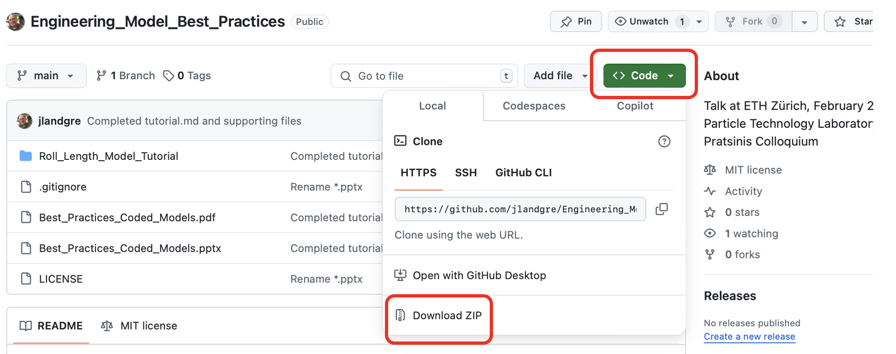

This repository contains my presentation (see *.pdf to directly view slides in Github) or click "Code" button / "Download Zip" to download all files.

The folder contains tutorial.md and associated case study files.

**Building Robust and Collaborative Coded Engineering Models**, J.D. Landgrebe, Data Delve LLC
**Colloquium on occasion of Professor Sotiris Pratsinis retirement**
Particle Technology Laboratory. Department of Mechanical & Process Engineering, ETH Zürich, Switzerland
February 26, 2025

